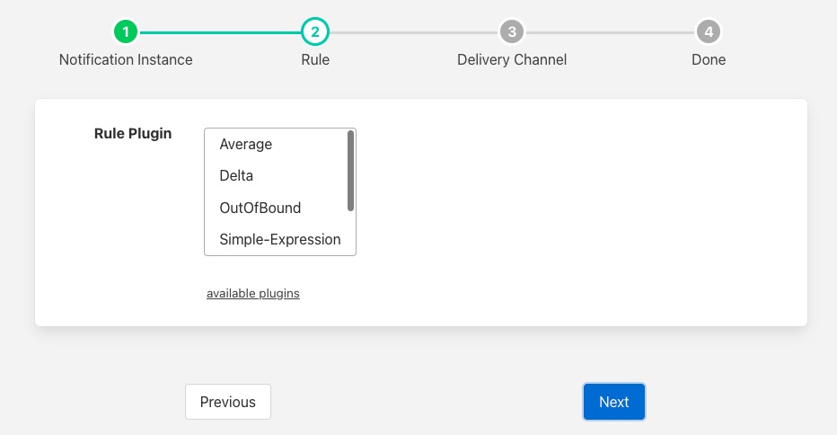
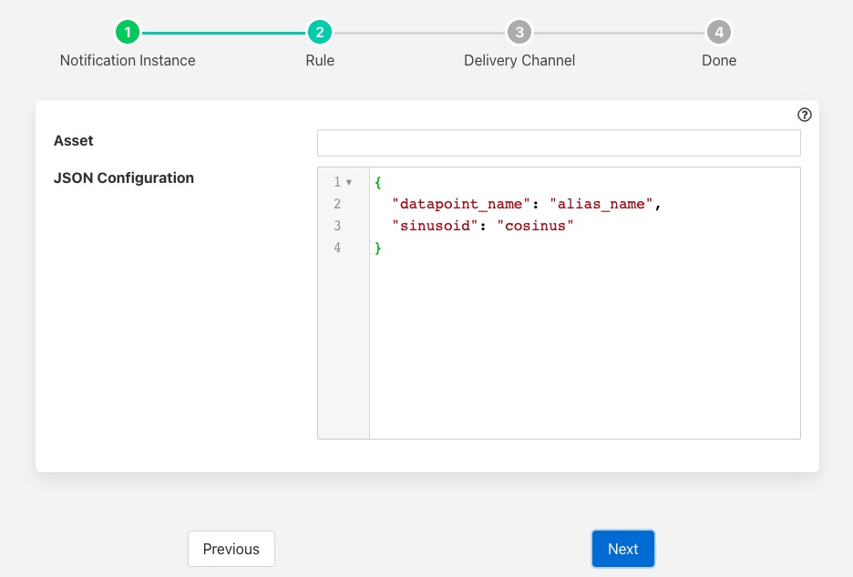

.. Images

Delta Rule
==========

The *fledge-rule-delta* plugin is a notifcation rule that triggers when a data point value changes. When a datapoint that is monitored changes the plugin will trigger. An alias value is given for the triggered datapoitn and is included in the reason mesage when the plugin triggers.

During the configuration of a notification use the screen presented to choose the delta plugin as the rule.

+-------------+
| |delta_1| |
+-------------+

The next screen you are presented with provides the configuration options for the rule.

+-------------+
| |delta_2| |
+-------------+

 - **Asset**: define the single asset that the plugin should monitor.

 - **Datapoints**: the datapoints monitor and the alias for the datapoint that is used in the trigger reason.

